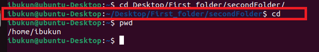
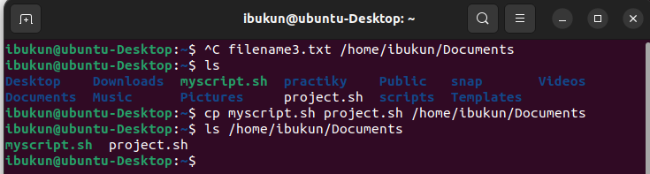
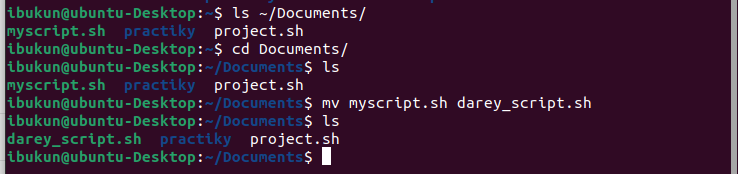
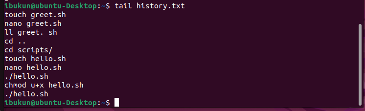
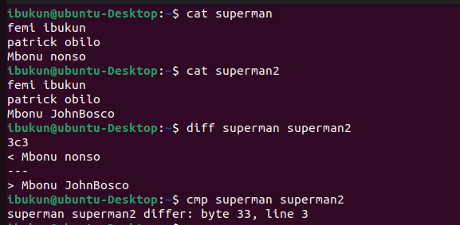

# Basic Linux Commands Implementation on ubuntu terminal
## Pre-requisites
-    Linux Operating System:
     Install a Linux distribution on your computer or set up a virtual machine. There are various Linux distributions available such as Ubuntu, CentOS, Fedora, Debian, etc.I Choose the one **[ubuntu]** that suits my needs and install it.
-   Terminal Emulator: Ubuntu comes with a default terminal emulator called "GNOME Terminal." You can access it by pressing Ctrl + Alt + T 
-   User Account: Make sure you have a user account with administrative privileges (sudo access). This will allow you to execute
    commands with elevated permissions when necessary.

#   FILE MANIPULATION

## 1. sudo command

sudo: Shot for superuser do, this is used to perform tasks that requires administartive or root priviledgies 
Upadte a list of packages in package manager

`run` 

`sudo apt ugrade`


## 2.  pwd command

The "pwd" command prints the full name (the full path) of current/working directory.

To do this, enter the following command.

`pwd`


## 3. cd command
To navigate through the Linux files and directories, use the **cd** command with option for either subdirectory or parent directory. Depending on your current working directory, it requires either the full path, and  
presently I'm in `/home/ibukun`. Therefore to navigate to subdirectory of ibukun *secondFolder* with fullpath.
To do so, enter the following command:

`cd Desktop/First_folder/secondFolder`


NB: Running `cd` *command* in the subdirectory without an option will take you to the home folder. Keep in mind that only users with sudo privileges can execute it.
As you are currently in **/home/ibukun/Desktop/First_folder/secondFolder**
To do so, enter the following command:
`cd`



Here are some shotcuts to you navigate.
To move up directory, enter the below command

`cd ..`


To move to the previous directory, enter the below command

`cd -`


## 4.  ls Command

ls is a Linux shell command that lists directory contents of files and directories.  It provides valuable information about files, directories, and their attributes.
### Syntax of `ls` command in Linux 

#### ls [option] [file/directory]

Description

`ls -R`   

`ls -a`

`ls -lh`


## 5.  cat Command
Cat command is used to display the content of files

### - Display a FIle content with cat command


### - Create a File with cat command
To create a file called “report.txt”, enter:

`cat >report.txt`

Type the following text:

``This is a test in the report.txt.``

You need to press [CTRL] + [D] i.e. hold the control key down, then tap d.


Another way to use "cat" command

### - To Combine Two Or More Files and store the output in another file


## 6. CP Command
cp command in linux is used to coppy files or directories
For examples 

`cp [sourcefile] [destination]`

`cp [filename1.txt filename2.txt filename3.txt] [/home/username/Documents]`



If copying a directory, you can use "-r" option
For examples 

`cp -r sourcedirectory destination`


## 7. mv command
The primary use of mv command is to move and rename files and directories. Additionally, it doesn't produce an output upon execution.
For example.

-   mv command for moving file

`mv sqlite.sh /home/username/Documents directory`


-   mv command for renaming file

change directory "cd" to the Documents, list the content of the directory with ls command and then rename 
myscript.sh to darey_script.sh with the bellow command

`mv myscript.sh darey_script.sh`



##  8. mkdir command
-   To make a directory TeraBox, use this command

`mkdir TeraBox`


-   To make a new directory "songs" inside TeraBox, type this command

```mkdir TeraBox/song```


## 9. rmdir Command

-   This command is used to permanently delete an empty directory.

`rmdir songs/`


-   To delete directory that has content, cd to the super-directory or parent directory, then type the following command

`rm -r TeraBox/songs`


## 10. Touch command

This is use to create file or files by separating the files with a space
First list the content of TeraBox and it return nothing. Then **cd into TeraBox**
Type the following command

`touch file1.txt file2.txt`

ls the content to show what is inside


## 11. locate command

The locate command can find a file in the database system
To use locate command, first install 


## 12. find command
The find command to search for files within a specific directory and perform subsequent operations.

Use the following command

`find /home -name file1.txt`


## 13. Grep COmmand

Grep can be use to find or search a regular expression or string in a text file. This is demonstrated below.
Run the command below

`grep Warrior project.sh`


As you can see, grep has not only searched and matched the string “Warrior” but has also printed the lines in which the string appears.

## 14.  df Command:
The syntax below is use to check the current directory's system disk space usage in a human-readable format

`df -h`

`df [options] [file]`


##  15. du command:
Du command run  to identify which part of system uses the storage excessively.
Adding a flag to the du command will modify the operation such as below.


##  16. Head Command

This command allows you to view the first 10 lines in a text.
Adding an option lets you change the number of lines shown. 
Here's the general syntax:

*head [option] [file]*

For instance, you want to view the first ten lines of history.txt, located in the /home/ibukun
To know the full content of history file

RUN this command
`cat history.txt`


Then type this command to see the first ten lines

`head history.txt`


The head command is also used
to output piped data to the CLI.

`cat historty.txt | head`


This will take the output of *cat history.txt* and display only the first five lines of that output specifying the number of lines you want to display with the -n option, like this:

`cat history.txt | head -n 5`


##  17. tail Command

This command is like a reverse of *head command* . It allows you to view the last 10 lines in a text.
Adding an option lets you change the number of lines shown. 
Here's the general syntax:

*tail [option] [file]*

`tail history.txt`



This will take the output of *cat history.txt* and display only the last two lines of that output specifying the number of lines you want to display with the -n option, like this:


`cat history.txt | tail -n 2`


##  18. diff Command

diff stands for difference. This command is used to display the differences in the files by comparing the files line by line

*diff [options] File1 File2*

`OPTION`
Linux system offers two different ways to view the diff command output i.e. context mode and unified mode. 

Applying diff command without any option we get the following output: 




Applying diff command with -c option we get the following output: 

-   *context mode*


-   *unified mode.*

 It is similar to context mode but it doesn’t display any redundant information or it shows the information in concise form. 

Applying diff command with -u option we get the following output: 


The first file **history.txt** is indicated by —, and the second file **project.sh** is indicated by +++. 
The first two lines of this output show us information about **history.txt** and **project.sh**. It lists the file name, modification date, and modification time of each of our files, one per line. 
After that the next line has two at sign @ followed by a line range from the first file (in our case lines 1 through 4, separated by a comma) prefixed by – and then space and then again followed by a line range from the second file prefixed by + and at the end two at sign @. Followed by the file content in output tells us which line remain unchanged and which lines needs to added or deleted(indicated by symbols) in the file 1 to make it identical to file 2. 

##  20. tar command:

The tar command archives multiple files into a TAR file - a common Linux format similar to ZIP, with optional compression.

Here's the basic syntax:

```tar [options] [archive_file] [file or directory to be archived]```

