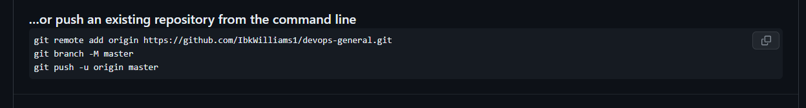

##  INITIALIZING A REPOSITORY AND MAKING COMMITS
### WHAT IS GIT?
Git is a type of version control system designed to monitor alterations made to your code, facilitating collaboration among developers. Prior to Git, alternative technologies like SVN addressed this issue, with Git taking a distinct approach. Unlike SVN, Git enables developers to create individual copies of the central repository, earning it the classification of a Distributed Version Control System (DVCS).

### INITIALIZING A GIT REPOSITORY
Before we can initialize a git repository, we must have installed git on our computer. After installing, to initialize a repo. We follow the below steps;

-   Open a terminal on the computer e.g Git bash; the default terminal after downloading and installing Git.

-   We open the terminal and create a working folder or directory e.g DevOps folder using this command 
```
mkdir DevOps.
```

-   After creating the folder or directory, we'll have to change or move into the working directory using this command 
```
cd DevOps.
```

-   While inside the folder/directory, we use the below command to initialize our repository.
```
git init
``` 


##  MAKING THE FIRST COMMIT
In the picture above, we successfully created our working directory and initialized a git repository. Now we will make our first commit. In git, commit simply means saving the changes (adding, modifying or deleting files or text) you made to your files. When we make a commit, git takes a snapshot of the current state of our repository and saves a copy in the .git folder inside our working directory().
let's make our first commit by following the below steps;

-   Inside our working directory, we create a new file called index.txt using this command touch index.txt.

-   After creating, input any text in the text file.

-   Then we add the changes to git staging area using this command git add .

-   To commit the changes to git, we use this command git commit -m "my first commit on index.html". The -m option/flag is used to add a commit message. The commit message provides context about the commit.


 ## Working with Branches
### Working with Branches
Imagine you have a note book and you want to write different story on different pages of your note book so that you do not mess up your previous note.

git branch helps you create a different copy(page) of your source code. In your new branch you can make changes as you please. Your change is independent of
what is available in the main copy.

Git branch is commonly used to develop new feature of your application. You will agree with me that the initial code is untested and as such can not be added to
the code base of your live application.

Git branch is also an important tool for collaboration within remote teams(developers working from different location). They can make separate branches while
working on same feature. And at the end of the day, converge their code to one branch.

Make your first git Branch
To make a new branch run this command: 

```
    git checkout -b
```

The use of the -b flag facilitates the creation and switching to a new branch. Now, we'll proceed to establish our initial branch by adhering to the following guidelines:

1. After completing our initial commit in the preceding lesson,
2. Generate a new branch by executing the specified command.
```
git checkout -b my-new-branch
```


###    To display your Git branches, 
utilize the following command to list them in your local repository.
 
 ```
 git branch
 ```


###    Change into an Old Branch
To change into an exiting or old branch use the command below:
e.g. I change to main branch
```
git checkout main
```


### Merging a Branch into another Branch
we have two branches main and my-new-branch. And we want to add the content of branch my-new-branch into main.

First we change into branch main and run the git command below:

```
git merge my-new-branch
```


###    Deleting a git branch
When new feature is added to an application, Its often done in a feature branch. Usually this feature branch is deleted when the code must have tested and
merged into a staging or dev environment depending on the branch strategy of the team.

Git branch can be deleted with the command below:

```
git branch -d my-new-branch
```


##  Collaboration and Remote Repositories
### Collaboration and Remote Repositories

Taking  a moment to recap about what I have learnt so far. I learnt that git is a distributed version control system. That essentially solves the problem
sharing source code and tracking changes made to source code.

I Further proceeds to demonstrate some operations like initializing git repository in our local machine, creating commit, branches etc.

I also mentioned in passing that git is used for collaboration among remote teams(developers residing in different location). But come to think of it how can
developers working remotely collaborate(making changes, adding, updating etc) on the same code base since we currently have our code in our local computer.

This where github comes in. Github is a web based platform where git repositores are hosted. By hosting our local git repository on github, it becomes available
in the public internet(it is possible to create private repository as well). Anyone can now access it.

Remote teams can now view, update, and make changes to the same repository.

Creating a Github Account

step 1: Head over to join ```github.com```

step 2: Next enter your username, password, and email


Creating your First Repository

step 1: click on the plus sign at the top right coner of your github account. A drop dwon menu will appear, select new repository

![fgf==erdtkou7wadhjpoyu7rdgfun[0pjf54el;]oi](images/cre8tingrepo.png)

####    Pushing your Local git Repository to your Remote github Repository.
In provious lessons, we have writting our story in our local git repository. Our friend is interested in contributing to our story but he is unable to do so because
we currently have our story locally in our machine.

Having created a github account and a github repository in earlier steps, Lets send a copy of our story to our repository in github.

We will achieve this by following the steps bellow:

-   Add a remote repository to the local repository using the command below:
```
git remote add origin https://github.com/IbkWilliams1/DevOps-Projects.git
```




To get the remote link click on the green button code, copy the https link. A screenshot is shown below.


-   After commiting the changes in my local repo. I push the content to the remote repo using the command below:

```
git push origin main
```
