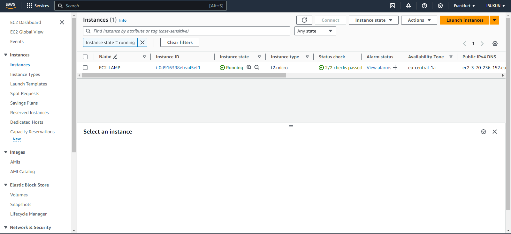
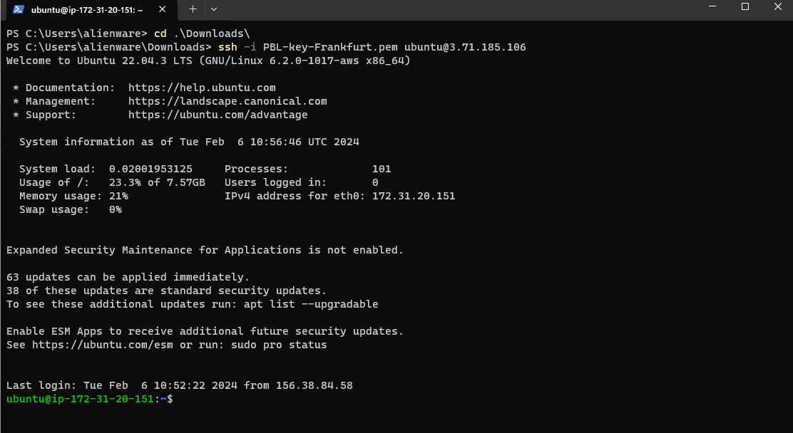
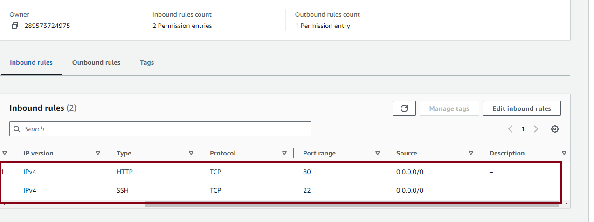
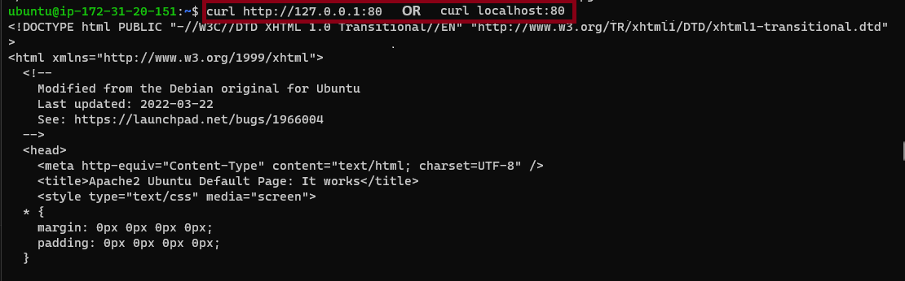
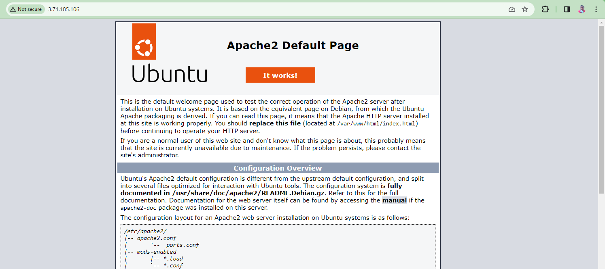
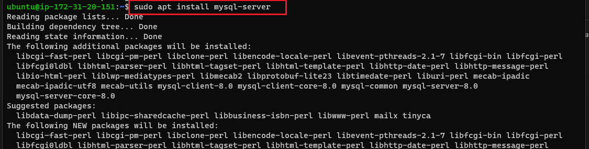
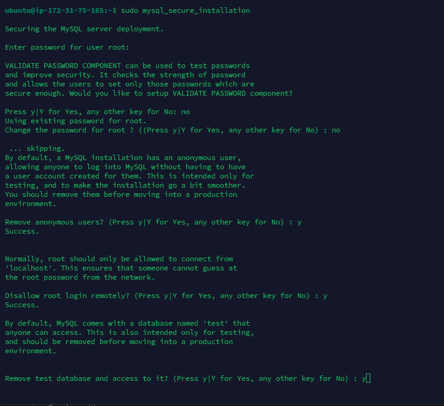
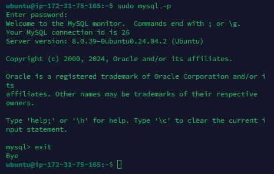
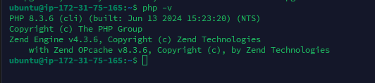

##  Deploying a LAMP Stack Web Application on AWS Cloud
A LAMP stack is a well-known software stack utilized for constructing and deploying web applications. The acronym "LAMP" encapsulates the essential elements of this stack:

**Linux** serves as the foundational operating system, chosen for its stability, security, and open-source characteristics. Commonly employed distributions in LAMP setups encompass Ubuntu, CentOS, and Amazon Linux.

__Apache__ functions as the web server software, responsible for serving and managing web requests. As an open-source and widely used web server, Apache adeptly handles both static and dynamic content.

__MySQL,__ a relational database management system (RDBMS), is employed for storing and managing the data of the application. Recognized for its reliability, performance, and user-friendly features, MySQL is a prevalent choice for database-driven web applications.

__PHP__, a server-side scripting language, is employed for crafting dynamic web pages. Embedded within HTML code and executed on the server, PHP generates dynamic content and interacts with the MySQL database to retrieve and manipulate data.

In summary, a LAMP stack furnishes a comprehensive and open-source environment for the development and hosting of web applications. Each constituent plays a distinct role:

- Linux provides the operating system.
- Apache serves as the web server.
- MySQL manages the relational database.
- PHP is responsible for server-side scripting and dynamic content generation.

This amalgamation is adaptable, widely embraced, and has served as the underpinning for numerous web applications across diverse industries. It empowers developers to fashion scalable and efficient web solutions using open-source technologies.

## Creation of EC2 Instance
Initially, we access AWS Cloud Services and generate an EC2 Ubuntu VM instance. During the instance creation process, opt for keypair authentication and save the private key (*.pem) to your local computer.

On windows terminal, cd into the directory containing the downloaded private key.Run the below command to log into the instance via ssh:

ssh -i <private_keyfile.pem> username@ip-address

Successful login into ec2 instance:


## Setting Up Apache Web 

To launch the web application, it is necessary to install Apache using the Ubuntu package manager, apt:

```
# Updating Packages

sudo apt update

sudo apt install apache2 -y
```


```
#starting apache2 Server
sudo systemctl start apache2

#ensuring apache2 starts automatically on system boot
sudo systemctl enable apache2

#checking server spunned
sudo systemctl status apache2
```

If it shows a green text" **active (running)** ", it means the web server has been successfully spunned and is live.

## Configuring Security Group Inbound Rules on EC2 Instance

A Security group functions as a set of regulations serving as a virtual firewall for managing incoming (inbound traffic) and outgoing (outbound traffic) data to and from an instance.

Upon instance creation, there is an automatically established TCP rule on port 22, facilitating SSH connections to a terminal. To guarantee accessibility of our webpages on the internet, it is necessary to create an inbound TCP rule opening port 80.



To check the accessiblity of our web server on the internet, we curl the IP address/DNS name of our localhost.

```
curl http://127.0.0.1:80  or curl http://localhost:80
```



To see if our web application server can respond to requests , use the public ip address of our instance on a web browser. http://<Public-IP-Address>:80


## Installing MySQL

We use MySQL as a relational database to store and manage data on our site.

Install mysql using the ```sudo apt install mysql``` command.



Use the ```sudo mysql_secure_installation``` command to remove insecure default settings and enable protection for the database.



On successful secure configuration, ```sudo mysql``` on the terminal to have access to the MySQL DB.

Exit from the MySQL terminal by typing ```exit```.

## Installing PHP and its Modules

PHP serves as a programming language which is useful for dynamically displaying contents of the webpage to users who make requests to the webserver.

We need to install php alongside its modules, ```php-mysql``` which is php module that allows php to communicate with the mysql database, ```libapache2-mod-php``` which ensures that the apache web server handles the php contents properly.

```
sudo apt install php php-mysql libapache2-mod-php.
```


On successfull installation of php and its modules we can check the version to see if it was properly installed.
```php -v```
