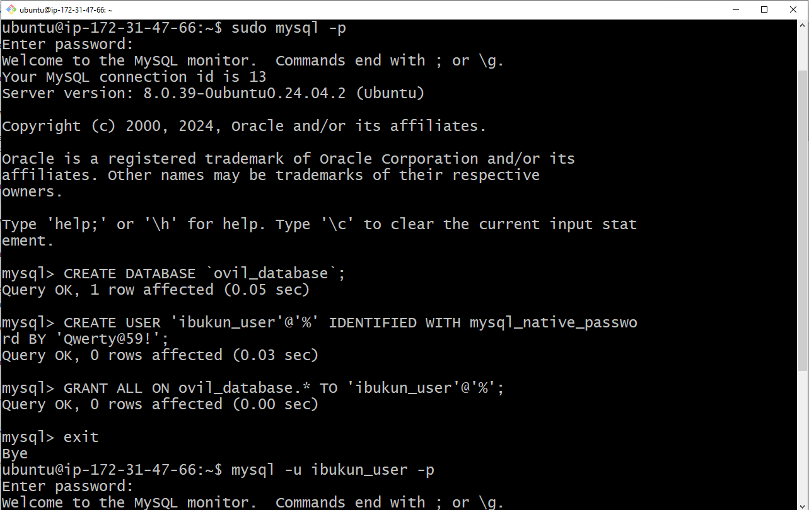
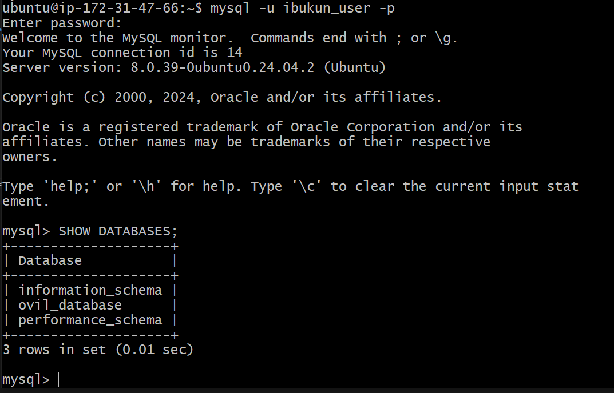
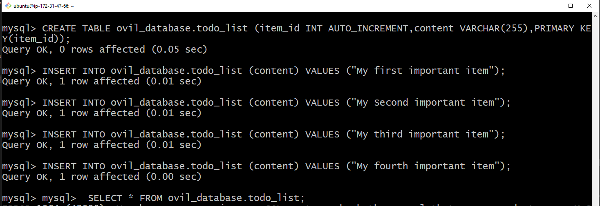
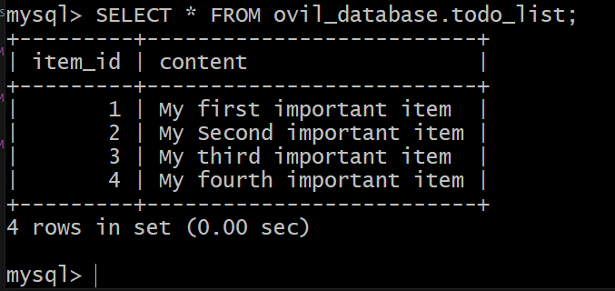
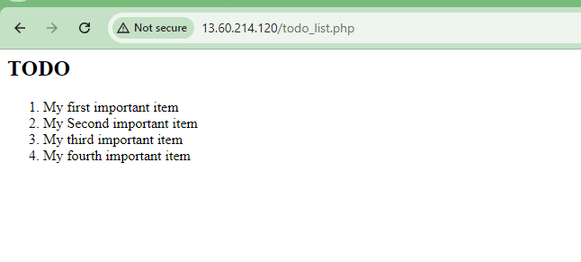

# WebStack LEMP Implementation (Linux, Nginx, MySQL, PHP) on AWS Free 
This README provides instructions on how to implement the LEMP (Linux, Nginx, MySQL, PHP) stack on an Ubuntu server running on AWS Free Tier. The LEMP stack is essential for hosting dynamic websites and web applications. We'll cover setting up each component, ensuring everything is properly configured, and testing to confirm the system is functional. LEMP enjoys good community support and is used around the world in many highly scaled web applications. Nginx is the second most widely used web server in the world following apache.
## Prerequisites
1. AWS Free Tier Account: Create an account at <a href="https://www.aws.amazon.com/free/">AWS Free Tier</a> to access the free resources.
2. Ubuntu Server: Launch an instance of Ubuntu Server using AWS EC2.
3. Terminal Access: You can use Git Bash (for Windows) or any terminal (macOS/Linux) to SSH into your Ubuntu server.
4. Git Desktop (optional): For terminal commands and file management on your local machine.

## 0. Update System Packages
I launched my Git Bash and connected to the AWS EC2 instance
I changed directory using cd Downloads and I run the command

`ssh -i <Your-private-key.pem> ubuntu@<EC2-Public-IP-address>`

```sh
ssh -i office-desktop.pem ubuntu@13.61.21.180
``` 

It will look like this:


## Step 1 – Installing the Nginx Web Server

To display web pages to our site visitors, we will use Nginx, a high-performance web server. I'll install it using the apt package manager. Since this is the first time we're using apt in this session, begin by updating the server's package index. After that, you can install Nginx with the apt install command.

```sh
 sudo apt update -y
 sudo apt install nginx -y
```


 Once the installation is finished, the Nginx web server will be active and running on your Ubuntu 20.04 server.

To verify that nginx was successfully installed and is running as a service in Ubuntu, run:
```sh
 sudo systemctl status nginx
```


It display green and running, which shows everything I did was correct - I you have just launched my first Web Server in the Clouds!

Before we can receive any traffic by our Web Server, we need to open TCP port 80 which is default port that web brousers use to access web pages in the Internet.

As we know, we have TCP port 22 open by default on our EC2 machine to access it via SSH, so we need to add a rule to EC2 configuration to open inbound connection through port 80:


Our server is running and we can access it locally and from the Internet (Source 0.0.0.0/0 means 'from any IP address').

First, let us try to check how we can access it locally in our Ubuntu shell, run:

 curl http://localhost:80

or

 curl http://127.0.0.1:80

I run the command ```curl http://localhost:80``` to assess it locally in my ubuntu shell


I aslo used http://13.60.172.201:80 to verify that it was correctly installed and accessible through firewall


## Step 2 — Installing MySQL
Now that i have a web server up and running, i need to install a Database Management System (DBMS) to be able to store and manage data for MY site in a relational database. MySQL is a popular relational database management system used within PHP environments, so i will use it in this project.


```sh
 sudo apt install mysql-server -y
```


When the installation is finished, log in to the MySQL console by typing:

```sh
 sudo mysql
```
This will connect to the MySQL server as the administrative database user root, which is inferred by the use of sudo when running this command. You should see output like this:


```sql
Welcome to the MySQL monitor.  Commands end with ; or \g.
Your MySQL connection id is 11
Server version: 8.0.22-0ubuntu0.20.04.3 (Ubuntu)

Copyright (c) 2000, 2020, Oracle and/or its affiliates. All rights reserved.

Oracle is a registered trademark of Oracle Corporation and/or its
affiliates. Other names may be trademarks of their respective
owners.

Type 'help;' or '\h' for help. Type '\c' to clear the current input statement.

mysql> 
```

It’s recommended that I run a security script that comes pre-installed with MySQL. This script will remove some insecure default settings and lock down access to my database system. Before running the script I will set a password for the root user, using mysql_native_password as default authentication method. We’re defining this user’s password as Qwerty@59!

```sql
ALTER USER 'root'@'localhost' IDENTIFIED WITH mysql_native_password BY 'Qwerty@59!';
```
Exit the MySQL shell with:

```sql
mysql> exit
```


Start the interactive script by running:

```sh
 sudo mysql_secure_installation
```


This will ask if you want to configure the `VALIDATE PASSWORD PLUGIN`.

**Note**: Enabling this feature is something of a judgment call. If enabled, passwords which don’t match the specified criteria will be rejected by MySQL with an error. It is safe to leave validation disabled, but you should always use strong, unique passwords for database credentials.

Answer `Y` for yes, or anything else to continue without enabling.

```
VALIDATE PASSWORD PLUGIN can be used to test passwords
and improve security. It checks the strength of password
and allows the users to set only those passwords which are
secure enough. Would you like to setup VALIDATE PASSWORD plugin?

Press y|Y for Yes, any other key for No:
```

If you answer “yes”, you’ll be asked to select a level of password validation. Keep in mind that if you enter `2` for the strongest level, you will receive errors when attempting to set any password which does not contain numbers, upper and lowercase letters, and special characters, or which is based on common dictionary words e.g `Qwerty@59!`. however, I enter `2` because my password passed the strongest validation level.

```sh
There are three levels of password validation policy:

LOW    Length >= 8
MEDIUM Length >= 8, numeric, mixed case, and special characters
STRONG Length >= 8, numeric, mixed case, special characters and dictionary              file

Please enter 0 = LOW, 1 = MEDIUM and 2 = STRONG: 1
```

Regardless of whether you chose to set up the `VALIDATE PASSWORD PLUGIN`, your server will next ask you to select and confirm a password for the MySQL **root** user. This is not to be confused with the **system root**. The **database root** user is an administrative user with full privileges over the database system. Even though the default authentication method for the MySQL root user dispenses the use of a password, **even when one is set**, you should define a strong password here as an additional safety measure. We’ll talk about this in a moment.

If you enabled password validation, you’ll be shown the password strength for the root password you just entered and your server will ask if you want to continue with that password. If you are happy with your current password, enter `Y` for “yes” at the prompt:

```
Estimated strength of the password: 100 
Do you wish to continue with the password provided?(Press y|Y for Yes, any other key for No) : y
```

For the rest of the questions, press `Y` and hit the `ENTER` key at each prompt. This will prompt you to change the root password, remove some anonymous users and the test database, disable remote root logins, and load these new rules so that MySQL immediately respects the changes you have made.

When you’re finished, test if you’re able to log in to the MySQL console by typing:

```sh
sudo mysql -p
```

Notice the `-p` flag in this command, which will prompt you for the password used after changing the **root** user password.

To exit the MySQL console, type:

```sql
mysql> exit
```

Notice that you need to provide a password to connect as the **root** user.

For increased security, it’s best to have dedicated user accounts with less expansive privileges set up for every database, especially if you plan on having multiple databases hosted on your server.

```
Note: At the time of this writing, the native MySQL PHP library mysqlnd doesn’t support caching_sha2_authentication, the default authentication method for MySQL 8. For that reason, when creating database users for PHP applications on MySQL 8, you’ll need to make sure they’re configured to use mysql_native_password instead. I’ll demonstrate how to do that in Step ahead.
```

My MySQL server is now installed and secured. Next, we will install PHP, the final component in the LEMP stack.

### Step 3 – Installing PHP

I have Nginx installed to serve my content and MySQL installed to store and manage my data. Now I can install [PHP](https://www.php.net) to process code and generate dynamic content for the web server.

While Apache embeds the PHP interpreter in each request, Nginx requires an external program to handle PHP processing and act as a bridge between the PHP interpreter itself and the web server. This allows for a better overall performance in most PHP-based websites, but it requires additional configuration. I’ll need to install `php-fpm`, which stands for “PHP fastCGI process manager”, and tell Nginx to pass PHP requests to this software for processing. Additionally, I’ll need `php-mysql`, a PHP module that allows PHP to communicate with MySQL-based databases. Core PHP packages will automatically be installed as dependencies.

To install these 2 packages at once, run:

```sh
 sudo apt install php-fpm php-mysql -y
```


I now have my PHP components installed. Next, I will configure Nginx to use them.

## Step 4 — Configuring Nginx to Use PHP Processor

When using the Nginx web server, we can create server blocks (similar to virtual hosts in Apache) to encapsulate configuration details and host more than one domain on a single server. In this guide, I will use **projectLEMP** as an example domain name.

On Ubuntu 20.04, Nginx has one server block enabled by default and is configured to serve documents out of a directory at `/var/www/html`. While this works well for a single site, it can become difficult to manage if I am hosting multiple sites. Instead of modifying `/var/www/html`, I’ll create a directory structure within `/var/www` for the **my_domain** website, leaving `/var/www/html` in place as the default directory to be served if a client request does not match any other sites.

I create the root web directory for **my_domain** as follows:

```sh
 sudo mkdir /var/www/projectLEMP
```

Next,I assign ownership of the directory with the $USER environment variable, which will reference my current system user:

```sh
 sudo chown -R $USER:$USER /var/www/projectLEMP
```

Then, open a new configuration file in Nginx’s `sites-available` directory using my preferred command-line editor. Here, I’ll use `nano`:

```sh
 sudo nano /etc/nginx/sites-available/projectLEMP
```

This will create a new blank file. I paste in the following bare-bones configuration:

```conf
#/etc/nginx/sites-available/projectLEMP

server {
    listen 80;
    server_name projectLEMP www.projectLEMP;
    root /var/www/projectLEMP;

    index index.php index.html index.htm ;

    location / {
        try_files $uri $uri/ =404;
    }

    location ~ \.php$ {
        include snippets/fastcgi-php.conf;
        fastcgi_pass unix:/var/run/php/php8.3-fpm.sock;
     }

    location ~ /\.ht {
        deny all;
    }

}
```
`NOTE:` that you must put the corresponding version of the php you installed in your configuration file. Here I have ``php8.3`` 
To get the version Run: 
```sh
php -v
```

Here’s what each of these directives and location blocks do:

* `listen` — Defines what port Nginx will listen on. In this case, it will listen on port `80`, the default port for HTTP.
* `root` — Defines the document root where the files served by this website are stored.
* `index `— Defines in which order Nginx will prioritize index files for this website. It is a common practice to list `index.html` files with a higher precedence than `index.php` files to allow for quickly setting up a maintenance landing page in PHP applications. You can adjust these settings to better suit your application needs.
* `server_name` — Defines which domain names and/or IP addresses this server block should respond for. **Point this directive to your server’s domain name or public IP address**.
* `location /` — The first location block includes a `try_files` directive, which checks for the existence of files or directories matching a URI request. If Nginx cannot find the appropriate resource, it will return a 404 error.
* `location ~ \.php$` — This location block handles the actual PHP processing by pointing Nginx to the fastcgi-php.conf configuration file and the `php7.4-fpm.sock file`, which declares what socket is associated with `php-fpm`.
* `location ~ /\.ht `— The last location block deals with `.htaccess` files, which Nginx does not process. By adding the deny all directive, if any `.htaccess` files happen to find their way into the document root ,they will not be served to visitors.

Having done editing, save and close the file. If you’re using `nano`, you can do so by typing `CTRL+X` and then `y` and `ENTER` to confirm.

I activate the configuration by linking to the config file from Nginx’s `sites-enabled` directory:

```sh
 sudo ln -s /etc/nginx/sites-available/projectLEMP /etc/nginx/sites-enabled/
```

This will tell Nginx to use the configuration next time it is reloaded. I can test my configuration for syntax errors by typing:

```sh
 sudo nginx -t
```
You shall see following message:

```sh
nginx: the configuration file /etc/nginx/nginx.conf syntax is ok
nginx: configuration file /etc/nginx/nginx.conf test is successful
```


Note: If any errors are reported, go back to your configuration file to review its contents before continuing.

We also need to disable default Nginx host that is currently configured to listen on port 80, for this run:

```sh
sudo unlink /etc/nginx/sites-enabled/default
```

When you are ready, reload Nginx to apply the changes:

```sh
 sudo systemctl reload nginx
```

My new website is now active, but the web root /var/www/projectLEMP is still empty. I'll create an index.html file in that location so that I can test that my new server block works as expected:

```sh
sudo echo 'Hello LEMP from hostname' $(curl -s http://169.254.169.254/latest/meta-data/public-hostname) 'with public IP' $(curl -s http://169.254.169.254/latest/meta-data/public-ipv4) > /var/www/projectLEMP/index.html
```

Now I go to my browser and try to open my website URL using Pqublic IP address:

```
http://<Public-IP-Address>:80
```

If you see the text from **_'echo'_** command you wrote to index.html file, then it means your Nginx site is working as expected.

In the output you will see your server's public hostname (DNS name) and public IP address. You can also access your website in your browser by public DNS name, not only by IP - try it out, the result must be the same (port is optional)

```
http://<Public-DNS-Name>:80
```


I leave this file in place as a temporary landing page for your application until I set up an `index.php` file to replace it. Once I do that, I will remove or rename the `index.html` file from your document root, as it would take precedence over an `index.php` file by default.

My LEMP stack is now fully configured. In the next step, I’ll create a PHP script to test that Nginx is in fact able to handle `.php` files within my newly configured website.

## Step 5 – Testing PHP with Nginx

My LEMP stack is now completely set up. 

At this point, my LEMP stack is completely installed and fully operational.

I can test it to validate that Nginx can correctly hand `.php` files off to your PHP processor.

I did this by creating a test PHP file in my document root. I open a new file called `info.php` within your document root in your text editor:

```sh
 nano /var/www/projectLEMP/info.php
```

I paste the following lines into the new file. This is valid PHP code that will return information about your server:

```php
<?php
phpinfo();
```

I can now access this page in my web browser by visiting the domain name or public IP address you’ve set up in your Nginx configuration file, followed by `/info.php`:

```
http://`server_domain_or_IP`/info.php
```
You will see a web page containing detailed information about your server:


After checking the relevant information about my PHP server through that page, it’s best to remove the file I created as it contains sensitive information about my PHP environment and my Ubuntu server. I'll use `rm` to remove that file:

```sh
 sudo rm /var/www/your_domain/info.php
```

You can always regenerate this file if you need it later.

## Step 6 — Retrieving data from MySQL database with PHP

In this step you will create a test database (DB) with simple "To do list" and configure access to it, so the Nginx website would be able to query data from the DB and display it.

At the time of this writing, the native MySQL PHP library `mysqlnd` doesn’t support `caching_sha2_authentication`, the default authentication method for MySQL 8. I’ll need to create a new user with the `mysql_native_password` authentication method in order to be able to connect to the MySQL database from PHP.

We will create a database named **ovil_database** and a user named **ibukun_user**, but you can replace these names with different values.

First, connect to the MySQL console using the **root** account:

```
$ sudo mysql
```

To create a new database, run the following command from your MySQL console:

```
mysql> CREATE DATABASE `ovil_database`;
```

Now you can create a new user and grant him full privileges on the database you have just created.

The following command creates a new user named `ibukun_user`, using mysql_native_password as default authentication method. We’re defining this user’s password as `Qwerty@59!`, but you should replace this value with a secure password of your own choosing.

```
mysql>  CREATE USER 'ibukun_user'@'%' IDENTIFIED WITH mysql_native_password BY 'Qwerty@59!';
```

Now we need to give this user permission over the `ovil_database` database:

```
mysql> GRANT ALL ON ovil_database.* TO 'ibukun_user'@'%';
```

This will give the **ibukun_user** user full privileges over the **ovil_database** database, while preventing this user from creating or modifying other databases on your server.

Now exit the MySQL shell with:

```
mysql> exit
```

You can test if the new user has the proper permissions by logging in to the MySQL console again, this time using the custom user credentials:

```
$ mysql -u example_user -p
```

Notice the `-p` flag in this command, which will prompt you for the password used when creating the `ibukun_user` user. After logging in to the MySQL console, confirm that you have access to the `ovil_database` database:

```
mysql> SHOW DATABASES;
```

This will give you the following output:


Next, I’ll create a test table named **todo_list**. From the MySQL console, I ran the following statement:

```
CREATE TABLE ovil_database.todo_list (item_id INT AUTO_INCREMENT,content VARCHAR(255),PRIMARY KEY(item_id));
```
I inserted a few rows of content in the test table. I repeated the next command a few times, using different VALUES:

```
mysql> INSERT INTO ovil_database.todo_list (content) VALUES ("My first important item");

```

To confirm that the data was successfully saved to my table, run:

```
mysql>  SELECT * FROM ovil_database.todo_list;
```

The following  is the output:


After confirming that I have valid data in your test table, I can exit the MySQL console:



```
mysql> exit
```

Now I can create a PHP script that will connect to MySQL and query for my content.I  create a new PHP file in your custom web root directory using your preferred editor. I’ll use nano for that:

```sh
nano /var/www/projectLEMP/todo_list.php
```

The following PHP script connects to the MySQL database and queries for the content of the **todo_list** table, displays the results in a list. If there is a problem with the database connection, it will throw an exception.

The following content was copied into my `todo_list.php` script:

```
<?php
$user = "ibukun_user";
$password = "Qwerty@59!";
$database = "ovil_database";
$table = "todo_list";

try {
  $db = new PDO("mysql:host=localhost;dbname=$database", $user, $password);
  echo "<h2>TODO</h2><ol>";
  foreach($db->query("SELECT content FROM $table") as $row) {
    echo "<li>" . $row['content'] . "</li>";
  }
  echo "</ol>";
} catch (PDOException $e) {
    print "Error!: " . $e->getMessage() . "<br/>";
    die();
}
```


The file was Saved and close when done editing.

I can now access this page in my web browser by visiting the domain name or public IP address configured for your website, followed by `/todo_list.php:`

```
http://<Public_domain_or_IP>/todo_list.php
```
You should see a page like this, showing the content you’ve inserted in your test table:



That means my PHP environment is ready to connect and interact with your MySQL server.
If you follow it through like 
## Congratulations!

In this guide , I have built a flexible foundation for serving PHP websites and applications to my visitors, using Nginx as web server and MySQL as database management system.


