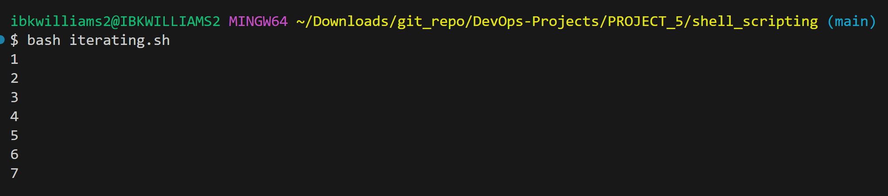

# SHELL SCRIPTING HANDS-ON PROJECTS.

## INTRODUCTION TO SHELL SCRIPTING AND USER INPUT.

## Shell Scripting Syntax Elements

## Variables:
Bash allows you to define and work with variables. Variables can store data of various type such as numbers, strings, and arrays. You can assign values to variables using the operator, and access their values using the variable name proceeded to a $ sign.

## Bash Shell Location 

```javascript
which bash
```


## EG. Assigning a value to a variable

```sh
name="ibukun"
```

## Retrieving value from a variable

```javascript
echo $name
```

2. Control Flow: Bash provides control flow statements like if-else, for loops, while loops, and case statement to control the flow of execution in your scripts. These statements allow you to make decisions, iterate over list, and execute different commands based on condition.


## Example script to check if a number is positive, negative, or zero


```sh
#!/bin/bash

read -p "Enter a number: " num

if [ $num -gt 0 ]; then
    echo "The number is positive."
elif [ $num -lt 0 ]; then
    echo "The number is negative."
else
    echo "The number is zero."
fi
```

The code asks you to input a number and displays a message indicating whether the number is positive or negative.

## Iterating through a list using a for loop


#### Example script to print numbers from 1 to 7 using a for loop

```sh
#!/bin/bash
for (( i=1; i<=7; i++ ))
do
    echo $i
done
```


## Assigning a variable via Command Substitution: 
Command substitution allows you to capture the output of the command and use it as a value within your script. You can use the backtick or the $() syntax for command substitution.
1) #### Capturing the current date and time:
* Backticks 
  for examples

```sh
  current_date=`date +%Y-%m-%d`
```
```sh
current_date=`date`
```

Though it is an older method and is less preferred due to readability issues, especially when nesting commands.

* $() Syntax:
This is a modern and more readable way to do command substitution. It can be nested more easily than backticks.
for examples;
```Shell
current_date=$(date +%Y-%m-%d)
```

This captures the output of the date command and stores it in the `current_date` variable.
* The `date` command prints the current date and time. The script captures this output using backticks and stores it in the `current_date` variable. The `echo` command then prints it.
```bash
current_directory=$(pwd)
```
2) #### Capturing the current working directory:

This captures the output of the `pwd` command and stores it in the `current_directory` variable.
* The `pwd` command prints the current directory path. The script captures this output using the `$()` syntax and stores it in the `current_directory` variable. The `echo` command then prints it.
3) #### Counting the number of files in the current directory:

```sh
   file_count=$(ls | wc -l)
echo "The number of files in the current directory: $file_count"
```

* The `ls` command lists the files in the current directory, and `wc -l` counts the number of lines output by `ls`, effectively counting the number of files. The script captures this value and stores it in the `file_count` variable.
  
4) #### Assinging Variable via Input and Output: 
   Bash provides various ways to handle input and output. You can use the read command to accept user input, and output text to the console using the echo command. Additionally, you can redirect input and output using operators like `>`(output to a file), `<` (input from a file), and `|` (pipe the output of one command as input to another)
* Accept user input
```sh
echo "Enter your name:"
read name
echo "Hello, $name! Welcome!"
```


* Output text to the terminal

```sh
echo "Hello World"
```


* Output the result of a command into a file. `Single Redirection`

```sh
echo "hello world" > index.txt
```


* Pass the content of a file as input to a command
```sh
grep "pattern" < input.txt
```
* grep:
    * A powerful command-line tool used for searching plain-text data sets for lines that match a specified pattern.
* "pattern":
    * The string or regular expression you are searching for. grep will look for occurrences of this pattern in the input.
* < input.txt:
    * The input redirection operator (<) is used to feed the contents of input.txt to the grep command as input

Alternatively,
```sh
grep "pattern" input.txt
```
achieves the same result as `grep "pattern" < input.txt`

* Pass the result of a command as input to another command.
 
```sh
echo "hello world" | grep "pattern"
```


### Function: 
Bash allows you to define and use functions to group related commands together.
 Functions provide a way to modularize your code and make it more reusable. You can define functions using the function keyword or simply by declaring the function name followed by parentheses.

```sh
#!/bin/bash

# Define a function to greet the user
greet() {
    echo "Hello, $1! Nice to meet you."
}

# Call the greet function and pass the name as an argument
greet "WIlliams"
```


## FILE OPERATIONS AND SORTING
This script generates three files (file1.txt, file2.txt, and file3.txt), displays their content in the original order, sorts them alphabetically, saves the sorted content in `sorted_files.txt` shows the sorted files, deletes the original files, renames the sorted file to `sorted_files_sorted_alphabetically.txt`, and finally displays the contents of the renamed file.
1) Launch the terminal and create a file named sorting.sh using the command.
```sh
touch sorting.sh
```

2. 
```sh
nano sorting.sh
```
Copy and paste the code below in the created file
```sh
#!/bin/bash

# Create three files
echo "Creating files..."
echo "This is file3." > file3.txt
echo "This is file1." > file1.txt
echo "This is file2." > file2.txt
echo "Files created."

# Display the files in their current order
echo "Files in their current order:"
ls

# Sort the files alphabetically
echo "Sorting files alphabetically..."
ls | sort > sorted_files.txt
echo "Files sorted."

# Display the sorted files
echo "Sorted files:"
cat sorted_files.txt

# Remove the original files
echo "Removing original files..."
rm file1.txt file2.txt file3.txt
echo "Original files removed."

# Rename the sorted file to a more descriptive name
echo "Renaming sorted file..."
mv sorted_files.txt sorted_files_sorted_alphabetically.txt
echo "File renamed."

# Display the final sorted file
echo "Final sorted file:"
cat sorted_files_sorted_alphabetically.txt
```

3. Set execute permission on sorting.sh using this command
   ```sh
   sudo chmod +x sorting.sh
   ```
4. Run the script using the command
   ```sh
   ./sorting.sh
   ```
   

## WORKING WITH NUMBERS AND CALCULATIONS
This script initializes two variables, `num1` and `num2`, with numerical values and carries out basic arithmetic operations, including addition, subtraction, multiplication, division, and modulus, displaying their outcomes. Additionally, it executes more advanced computations, such as raising `num1` to the power of 2 and finding the square root of `num2`, and displays these results as well.

The process is outlined as follows:
Step 1: Create a file called
```sh
touch calculations.sh
```

Step 2: Make the script executable:
```bash
chmod +x calculation.sh
```
Step 3: Open the file in a text editor to add your script content:
```bash
nano calculation.sh
```
Step 4: Write the following script inside `calculation.sh`:
```bash
#!/bin/bash

# Define two variables with numeric values
num1=10
num2=5

# Perform basic arithmetic operations
sum=$((num1 + num2))
difference=$((num1 - num2))
product=$((num1 * num2))
quotient=$((num1 / num2))
remainder=$((num1 % num2))

# Display the results
echo "Number 1: $num1"
echo "Number 2: $num2"
echo "Sum: $sum"
echo "Difference: $difference"
echo "Product: $product"
echo "Quotient: $quotient"
echo "Remainder: $remainder"

# Perform some more complex calculations
power_of_2=$((num1 ** 2))
square_root=$(echo "sqrt($num2)")

# Display the results
echo "Number 1 raised to the power of 2: $power_of_2"
echo "Square root of number 2: $square_root"
```
Step 5: Run the script:
```bash
./calculations.sh
```

## FILE BACKUP AND TIMESTAMPING
This script specifies the paths for the source and backup directories. It then generates timestamps using the current date and time, creating a backup directory with the timestamp included in its name. The script proceeds by copying all files from the source directory to the backup directory using the `cp` command with the `-r` option for recursive copying. Finally, the script outputs a message confirming the completion of the backup and displays the path of the backup directory with the timestamp.

Outlined steps:

Step 1: Create a file named:
```sh
touch backup.sh
```

Step 2: Make the script executable:
```sh
sudo chmod +x backup.sh
```
Step 3: Open the file in a text editor to add your script content:
```sh
nano backup.sh
```
Step 4: Write the following script inside `backup.sh`:

```sh
#!/bin/bash

# Define the source directory and backup directory
source_dir="/path/to/source_directory"
backup_dir="/path/to/backup_directory"

# Create a timestamp with the current date and time
timestamp=$(date +"%Y%m%d%H%M%S")

# Create a backup directory with the timestamp
backup_dir_with_timestamp="$backup_dir/backup_$timestamp"

# Create the backup directory
mkdir -p "$backup_dir_with_timestamp"

# Copy all files from the source directory to the backup directory
cp -r "$source_dir"/* "$backup_dir_with_timestamp"

# Display a message indicating the backup process is complete
echo "Backup completed. Files copied to: $backup_dir_with_timestamp"
```