## AWS MERN WEB STACK IMPLEMENTATION

This project shows how to implement a web solution on MERN stack in AWS Cloud

 MERN stands for (MongoDB, ExpressJS, ReactJS, Node.js,)

```
Creating EC2 Instance
```

I log on to AWS Cloud Services and create an EC2 Ubuntu Instance. When creating an instance, choose keypair authentication downloaded to local system.
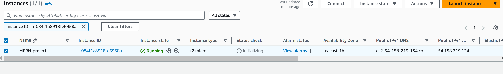
### ................Backend Configuration.............

Run the following command to update and upgrade our ubuntu instance:
```sh
sudo apt update && sudo apt upgrade -y
```
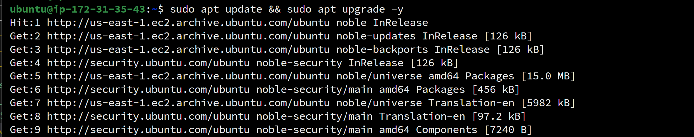

Lets get the location of Node.js software from Ubuntu repositories.
Run the following command:

```sh
curl -fsSL https://deb.nodesource.com/setup_18.x | sudo -E bash -
```
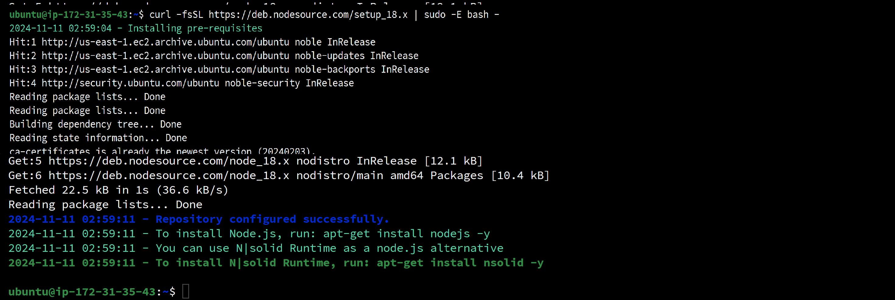

## To Install Node.js on the server

Install Node.js with the command below

```sh
sudo apt-get install nodejs -y
```
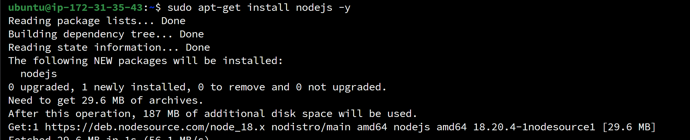

Note: The command above installs both nodejs and npm. NPM is a package manager for Node like apt for Ubuntu, it is used to install Node modules & packages and to manage dependency conflicts.

Verify the node installation with the command below
```sh
node -v
```
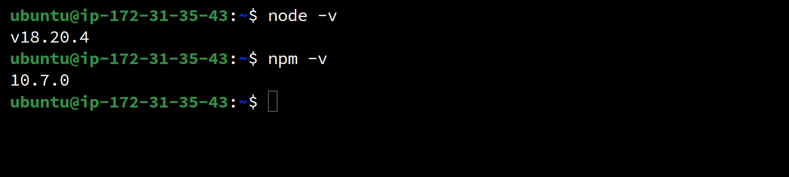

## Application Code Setup
Create a new directory for your To-Do project:

```sh
mkdir Todo
```

Run the command below to verify that the Todo directory is created with ls command

```sh
ls
```
Inside the Todo directory we will instantiate our project using npm init. This enables javascript to install packages useful for spinning up our application.
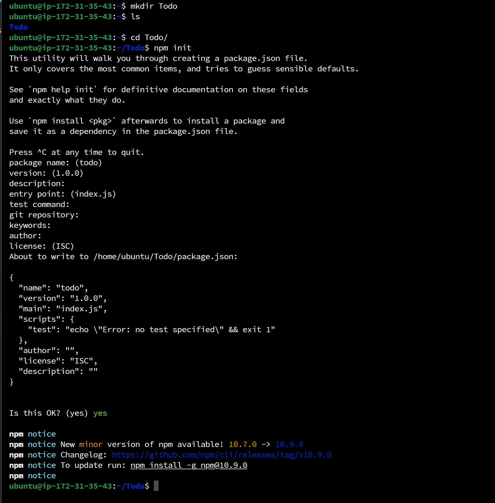
Press `Enter` key several times to accept default values, then accept to write out the package.json file by typing yes

Run the command `ls` to confirm that you have package.json file created.
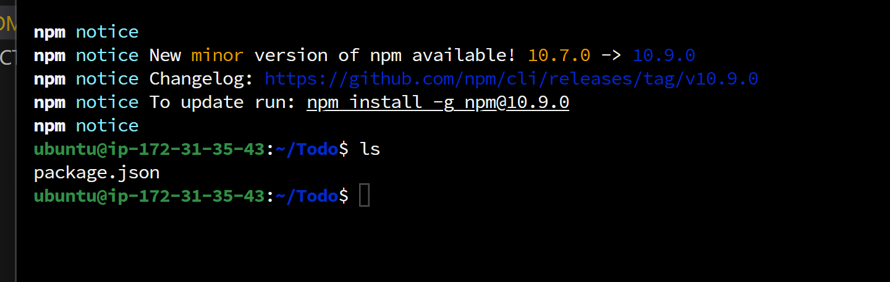
Run the below command to keep the npm up-to-date
```sh
sudo npm install -g npm@10.9.0
```
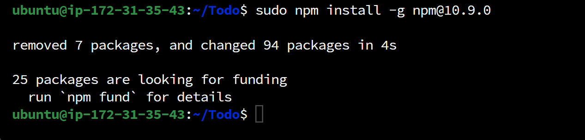

Next, we will Install **ExpressJs** and create the Routes directory.
Keep in mind that Express is a framework built for `Node.js`, which means it handles many tasks that developers would typically code themselves. This leads to easier development and abstracts many low-level aspects. For instance, Express simplifies defining application routes by associating them with HTTP methods and URLs.

To start using Express, install it via `npm`:
Run
```sh
npm install express
```
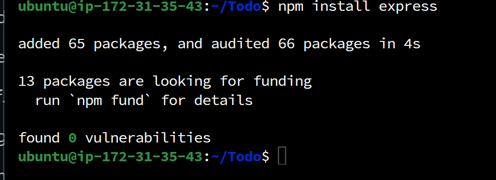
Now create a file index.js with the command below
```sh
touch index.js
```
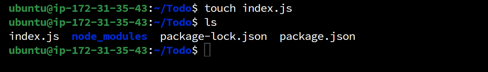
Run `ls` to confirm that your index.js file is successfully created.

In a MERN (MongoDB, Express.js, React, Node.js) stack application, the dotenv module is commonly used to manage environment variables. Therefore to install dotenv, Run:
```sh
npm install dotenv
```
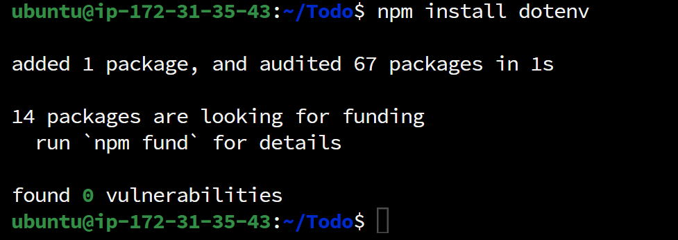

Open the `index.js` file with the command below
```sh
nano index.js
```
Type the code below into it and save.

```sh
const express = require('express');
require('dotenv').config();

const app = express();

const port = process.env.PORT || 5000;

app.use((req, res, next) => {
res.header("Access-Control-Allow-Origin", "\*");
res.header("Access-Control-Allow-Headers", "Origin, X-Requested-With, Content-Type, Accept");
next();
});

app.use((req, res, next) => {
res.send('Welcome to Express');
});

app.listen(port, () => {
console.log(`Server running on port ${port}`)
});
```
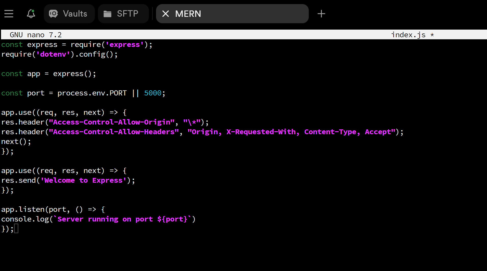
Now it is time to start our server to see if it works. Open your terminal in the same directory as your index.js file and type:

```sh
node index.js
```
If every thing goes well, you should see Server running on port 5000 in your terminal.
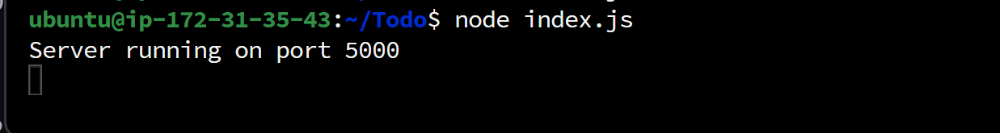

We now need to open this port in the EC2 Security Groups. An inbound rule was previously created to open TCP port 80, and you should follow the same steps for port 5000, as shown below.
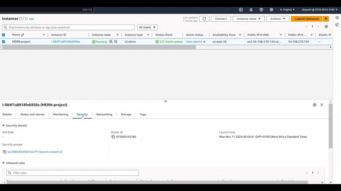
Open up your browser and try to access your server’s Public IP or Public DNS name followed by port 5000:
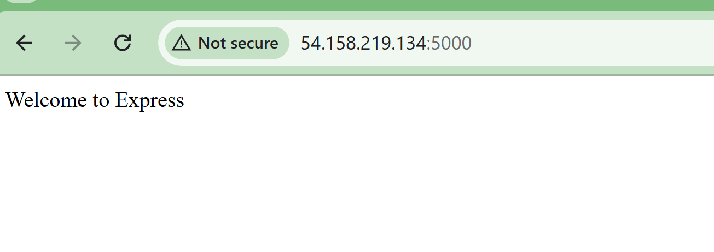

## Defining Routes For Our Applications
There are three actions that our To-Do application needs to be able to do:

1. Create a new task
2. Display list of all tasks
3. Delete a completed task
Each task will be associated with some particular endpoint and will use different standard [HTTP request methods](https://developer.mozilla.org/en-US/docs/Web/HTTP/Methods): POST, GET, DELETE.

For each task, we need to create [`routes`](https://expressjs.com/en/guide/routing.html) that will define various endpoints that the `To-do` app will depend on. So let us create a folder `routes`

```
$ mkdir routes
```

**Tip:** You can open multiple shells in Termius,  Putty or Linux/Mac to connect to the same EC2

Change directory to `routes` folder.

```
$ cd routes
```

Now, create a file `api.js` with the command below

```
touch api.js
```

Open the file with the command below

```
vim api.js
```

Copy below code in the file. (*Do not be overwhelmed with the code*)

```
const express = require ('express');
const router = express.Router();

router.get('/todos', (req, res, next) => {

});

router.post('/todos', (req, res, next) => {

});

router.delete('/todos/:id', (req, res, next) => {

})

module.exports = router;
```

*Moving forward let create Models directory.*
#### ----------------Creating Models-----------------------

Now comes the interesting part, since the app is going to make use of [Mongodb](https://www.mongodb.com/) which is a NoSQL database, we need to create a model.

A model is at the heart of JavaScript based applications, and it is what makes it interactive.

We will also use models to define the database schema . This is important so that we will be able to define the fields stored in each Mongodb document. ***(Seems like a lot of information, but not to worry, everything will become clear to you over time. I promise!!!)***

In essence, the Schema is a blueprint of how the database will be constructed, including other data fields that may not be required to be stored in the database. These are known as *virtual properties*

To create a Schema and a model, install *[mongoose](https://mongoosejs.com/)* which is a Node.js package that makes working with mongodb easier.

Change directory back Todo folder with `cd ..` and install Mongoose

```
$ npm install mongoose
```

Create a new folder with `mkdir models` command

Change directory into the newly created 'models' folder with `cd models`. 

Inside the models folder, create a file and name it `todo.js`

```
touch todo.js
```

**Tip:** All three commands above can be defined in one line to be executed consequently with help of `&&` operator, like this:

```
mkdir models && cd models && touch todo.js
```

Open the file created with `vim todo.js` then paste the code below in the file:

```
const mongoose = require('mongoose');
const Schema = mongoose.Schema;

//create schema for todo
const TodoSchema = new Schema({
action: {
type: String,
required: [true, 'The todo text field is required']
}
})

//create model for todo
const Todo = mongoose.model('todo', TodoSchema);

module.exports = Todo;
```
Now we need to update our routes from the file `api.js` in 'routes' directory to make use of the new model.

In Routes directory, open api.js with `vim api.js`, delete the code inside with `:%d` command and paste there code below into it then save and exit

```
const express = require ('express');
const router = express.Router();
const Todo = require('../models/todo');

router.get('/todos', (req, res, next) => {

//this will return all the data, exposing only the id and action field to the client
Todo.find({}, 'action')
.then(data => res.json(data))
.catch(next)
});

router.post('/todos', (req, res, next) => {
if(req.body.action){
Todo.create(req.body)
.then(data => res.json(data))
.catch(next)
}else {
res.json({
error: "The input field is empty"
})
}
});

router.delete('/todos/:id', (req, res, next) => {
Todo.findOneAndDelete({"_id": req.params.id})
.then(data => res.json(data))
.catch(next)
})

module.exports = router;
```
The next piece of our application will be the MongoDB Database

### Creating MongoDB Database
We will need a database to store all information when we make a post request to an endpoint. We will be using mLab which provides a DBaaS (Database as a service) solution.

For this we will make use of mLab which provides MongoDB as a service solution to create a cluster.
