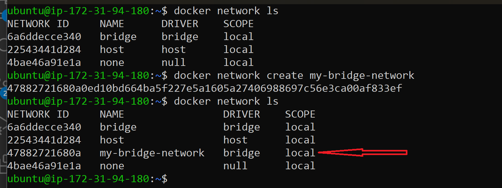
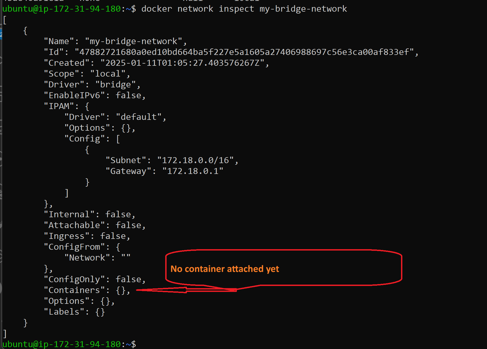
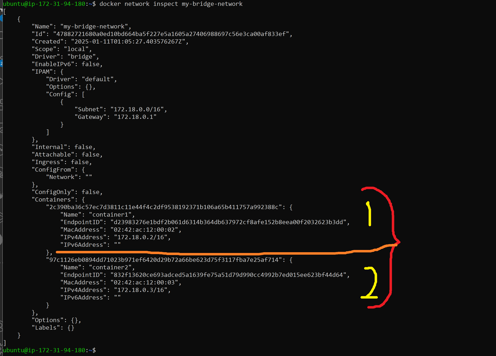
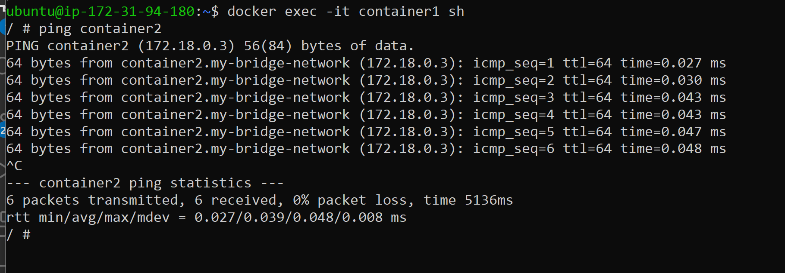
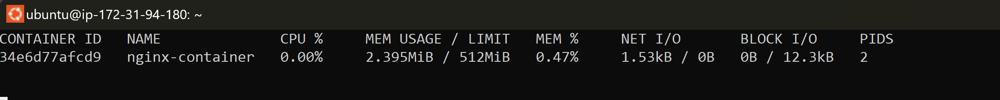
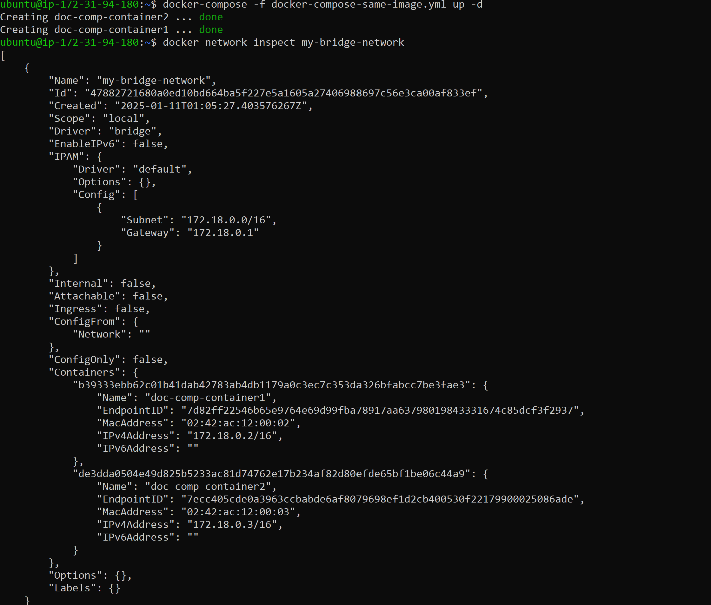
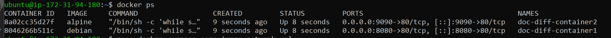
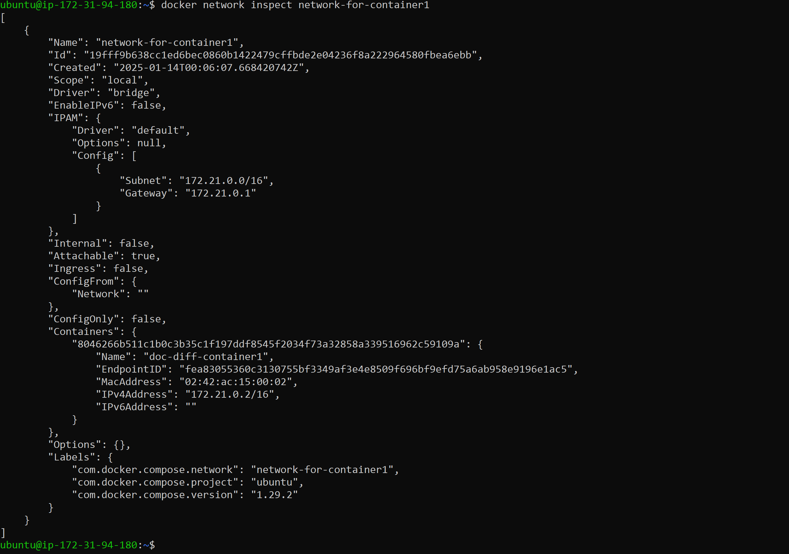
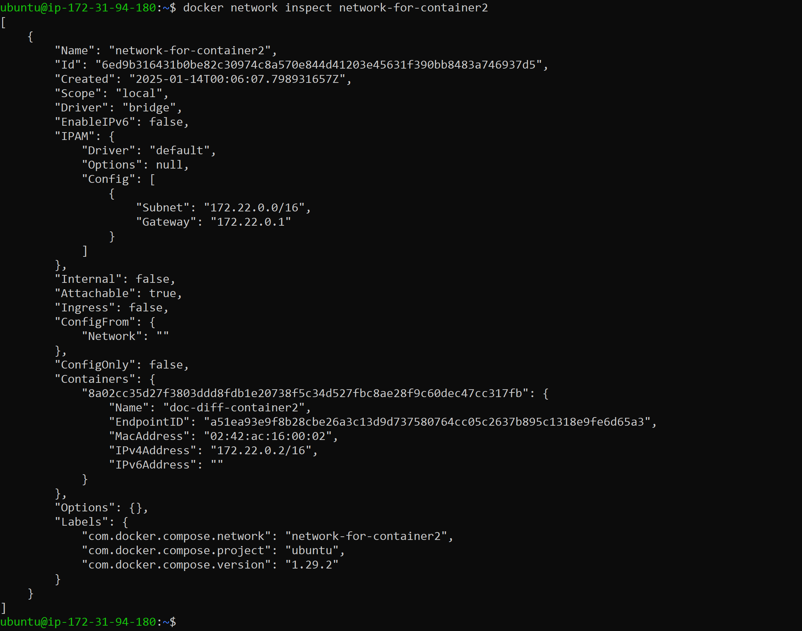
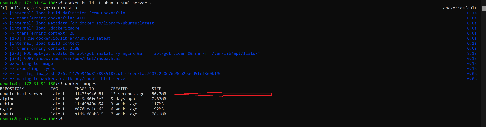

# Dockerized Microservices Architecture with Networking and Security Enhancements

### Project Overview

This project demonstrates the core concepts of containerization, resource management, networking, and security in a microservices-based architecture using Docker and Docker Compose. The tasks are designed to showcase essential skills required for deploying, managing, and securing containers in a DevOps environment.

### Key Features

1. Custom Docker Networking:
    - Creation of custom bridge networks to enable container-to-container communication.
    - Network exploration and debugging using tools like ping, nslookup, and traceroute.

2. Resource-Constrained Containers:

    - Deploying an Nginx container with CPU and memory limits for efficient resource utilization.

3. Infrastructure as Code (IaC) with Docker Compose:

    - Deploying single and multiple containers using YAML-based Docker Compose files.
    - Demonstrating shared and isolated network configurations.

4. Security Assessment:

Building a custom Docker image serving static content and scanning for vulnerabilities using Trivy.

5. Practical Application:

    - Real-world simulation of deploying a static website, managing container resources, and ensuring image security.

### Learning Outcomes

- Understanding Docker networking and container communication.
- Implementing resource constraints to optimize container performance.
- Automating container deployment using Docker Compose.
- Enhancing security by identifying vulnerabilities in container images.
- Applying troubleshooting techniques for containerized applications.

---

#### Task 1: Spin up two Docker containers, run them within the same bridge network, and interact between them

#### Steps:
##### 1. Create a custom Docker bridge network:
The creation of a user-defined bridge network in Docker is done using the following command:
```bash
docker network create --driver bridge my-bridge-network
```




- ```my-bridge-network``` is the name of the user-defined bridge network.
- Docker automatically creates a virtual switch and assigns a subnet, gateway, and IP range.
##### 2. Run two containers attached to the same network:
```bash
docker run -dit --name container1 --network my-bridge-network alpine sh
docker run -dit --name container2 --network my-bridge-network alpine sh
```
User defined bridge network called ```my-bridge-network``` with containers attached.
using the following commands to verify:
```bash
docker network inspect my-bridge-network
```



##### 3. Verify network connectivity:
- Access **container1**
- Ping **container2** by name:

```bash
docker exec -it container1 sh
```


From the output provided, it appears I've successfully pinged container2 from container1 within the same Docker network. Here's a breakdown of what this output indicates:

- **Container Names**: I used (container1 and container2) directly to communicate, which suggests they are connected to the same Docker network, a user-defined bridge network ```my-bridge-network ```
- **IP Resolution:** Docker's internal DNS resolves container2 to the ```IP address 172.18.0.3,``` which is a typical Docker bridge network IP range. This confirms that DNS service within Docker is functioning for container name resolution.
**Ping Success**: The ping command was successful with no packet loss, and the round-trip times (RTT) are very low, indicating good network performance between the containers.
**Network Setup**: The presence of my-bridge-network in the hostname confirms I've either explicitly created a bridge network and  Docker has assigned a similar default name.
---

#### Task 2: Run an Nginx container with specific memory and CPU limits
##### Steps:
##### 1. Run the Nginx container with resource constraints:
```bash
docker run -dit --name nginx-container --memory 512m --cpus 0.5 nginx
```
##### 2. Verify the resource limits:
```bash
docker stats nginx-container
```
the output should look like this


##### Explanation of this Columns above:

1. **CONTAINER ID**: Unique identifier for the container.
2. **NAME**: Name of the container (nginx-container in this case).
3. **CPU %**: Percentage of the CPU allocated to the container being utilized.
4. **MEM USAGE / LIMIT**:
    - Memory currently used by the container vs. the memory limit (512 MiB in this case).
   - Example: If MEM USAGE / LIMIT shows 2.395MiB / 512MiB, it means the container is using 2.395MiB of memory out of the allocated 512MiB.
5. **MEM %**: Percentage of the allocated memory currently in use.
6. **NET I/O**: Total incoming (I/O) and outgoing network traffic for the container.
7. **BLOCK I/O**: Total read and write operations on the container’s file system.
8. **PIDS**: Number of processes or threads running inside the container.
Continuous Monitoring:
The ``docker stats`` command keeps updating the metrics in real-time. To stop monitoring, press ``Ctrl+C.``

---

#### Task 3: Deploy Task 2 using a Docker Compose file
##### Steps:
1. Create a docker-compose.yml file:
```YAML
services:
  nginx:
    image: nginx
    container_name: nginx-compos-container
    deploy:
      resources:
        limits:
          memory: 512m
          cpus: "0.5"
```
2. Deploy with Docker Compose:
```bash
docker-compose -f docker-comp-lim-rsc.yml up -d
```
before running docker-compose, verify that it's installed
with the following command:
```bash
sudo apt  install docker-compose -y
```
3. Verify the container is running:
```bash
docker ps
```
The output of docker-compose should look like:


---

#### Task 4: Deploy two containers on Docker Compose using the same image and network bridge.
##### Steps:
1. Create a docker-compose-same-image-network.yml file:

```YAML
networks:
 2   my-bridge-network:
 3     name: my-bridge-network
 4     driver: bridge
 5
 6 services:
 7   container1:
 8     image: ubuntu
 9     container_name: doc-comp-container1
10     entrypoint: /bin/sh -c "while sleep 1000; do :; done"
11     command: bash
12     networks:
13       - my-bridge-network
14
15   container2:
16     image: ubuntu
17     container_name: doc-comp-container2
18     entrypoint: /bin/sh -c "while sleep 1000; do :; done"
19     command: bash
20     networks:
21       - my-bridge-network
```
**NB:** Docker Compose by default prefixes the network name with the directory name where the docker-compose.yml file resides or with a project name if specified.
If you want the network name to match exactly what's in your Docker Compose file:
You can run Docker Compose with a custom or no project name:
```bash
docker-compose -p "" -f docker-compose-same-image-network.yml up -d
```

2. Deploy with docker-compose-same-image-network.yml


```bash
docker-composed -p "" -f docker-compose-same-image-network.yml up -d
```
OR you start organize the docker-compose file with the network just like the above.
3. Verify the containers & network:
```bash
docker ps -a
```
and run the following command

```bash
docker network inspect my-bridge-network
```


---


#### Task 5: Deploy two containers on Docker Compose using different images and network bridges
##### Steps:
1. Create a docker-compose-diff-image-network.yml file or name it as you prefer:
and paste the following YAML into it
```YAML
networks:
  network-for-container1:
    name: network-for-container1
    driver: bridge

  network-for-container2:
    name: network-for-container2
    driver: bridge

services:
  container1:
    image: debian
    container_name: doc-diff-container1
    entrypoint: /bin/sh -c "while sleep 1000; do :; done"
    command: bash
    networks:
      - network-for-container1
    ports:
      - "8080:80" # Exposes port 80 in the container to port 8080 on the host

  container2:
    image: alpine
    container_name: doc-diff-container2
    entrypoint: /bin/sh -c "while sleep 1000; do :; done"
    command: sh
    networks:
      - network-for-container2
    ports:
      - "9090:80" # Exposes port 80 in the container to port 9090 on the host
```
2. create a user-defined network bridge for two containers
```bash
docker network create --driver bridge network-for-container1
docker network create --driver bridge network-for-container2
```
The docker-compose-diff-image-network.yml necessitate that we create a another 
user-defined network for the containers.

3. Deploy the docker-compose-diff-image-network.yml with the following command:
   
   ```bash
   docker-compose -p "" -f docker-compose-diff-image-network.yml up -d
   ```
4. Verify the containers & network:
```bash
docker ps -a
```
should show the following:

and run the following command

```bash
docker network inspect network-for-container1
docker network inspect network-for-container2
```
1

2


---

#### Task 6: Deploy an HTML file with a Dockerfile and scan for vulnerabilities

##### Step-by-Step Instructions
###### 1. Create the Required Files
  1. Create the HTML file (index.html): using nano editor make  index.html and paste the following:
  ```html
  <!DOCTYPE html>
<html>
<head>
    <title>Task 6 - Simple HTML Page</title>
</head>
<body>
    <h1>Hello, this is Task 6 by williams!</h1>
    <p>This is served from an Ubuntu-based Docker container.</p>
</body>
</html>
```

Rename index.html to index.nginx-debian.html

  2. Create the Dockerfile (Dockerfile):
  ```Dockerfile
# Use Ubuntu as the base image
FROM ubuntu

# Install required dependencies
RUN apt-get update && apt-get install -y nginx

# Copy the HTML file to the nginx web server directory
COPY index.nginx-debian.html /var/www/html

# Start nginx in the foreground
CMD ["nginx", "-g", "daemon off;"]
```
---
###### 2. Build and Run the Container
  1. Build the Docker image:
  ```bash
  docker build -t ubuntu-html-server .
```


 2. Run the container
 ```bash
 docker run -d --name ubuntu-html-server -p 8080:80 ubuntu-html-server
```
 3. Verify the server is running by accessing (http://44.208.24.166:8080/) in your browser. You should see the "Task 6 - Simple HTML Page."